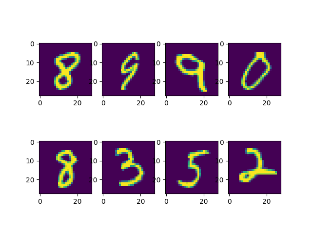

<div align="left">    
 
# Hog based MNIST classifier using pytorch 
 
## Table of contents
* [Description](#description)
* [Dataset preparation](#datasetpreparation)
* [How to Run](#howtorun)
* [Model](#model)
* [Experiments](#experiments)
* [Results](#results)
 
## Description  

This Project classifies MNIST dataset consisting of handwritten digits between 0-9 using Histogram of Oriented Gradients(HOG) features. Pytorch is used for building this classifier. MNIST contains 70,000 images of handwritten digits: 60,000 for training and 10,000 for testing. The images are grayscale, 28x28 pixels. 

Nowadays, Convolutional Neural Networks(CNN) are the state of the art for classifying the MNIST dataset. But this project focuses mainly on how HOG parameters influence the feature extraction process and influence the classification. 

## Dataset preparation

The datasets are downloaded from the ``` torchvision.datasets.MNIST ``` and pytorch dataloader ``` torch.utils.data.DataLoader``` to load batches of training data. 

Few images of dataset are visualized here in below figure.



The Dataset consists of ```70000``` images in which ```40000``` are used for training ```20000``` for validation and ```10000``` for testing.

## How to run   
First, install dependencies   
```bash
# clone project   
git clone https://github.com/Krishnateja244/Hog-based-MNIST-classifier-using-pytorch-.git

# install project   
cd Hog-based-MNIST-classifier-using-pytorch  
pip install -r requirements.txt
 ```   
 Next, navigate to any file and run it.   
 ```bash

# module folder
cd project

# run module 
python train.py
```

## Model

This project uses a simple Linear classifier using ```torch.nn.Module```. Model uses ``` torch.nn.CrossEntropyLoss()``` for calculating the loss. Inorder to evaluate the model, the validation loss is calculated along with training loss to observe any case of ```Overfitting``` or ```Underfitting```.

### Hyperparameters
Epoches: 21
Optimizer: Adam
Learning rate: 0.001
Batchsize : 8 

```python
class Linear(torch.nn.Module):
    def __init__(self,in_dim,out_dim):
        super().__init__()
        self.in_features = in_dim
        self.out_dim = out_dim
        self.weights = torch.nn.Parameter(torch.randn(out_dim,in_dim))
        self.bias = torch.nn.Parameter(torch.randn(out_dim))
    
    def forward(self,inputs):
        output = inputs @ self.weights.t() +self.bias
        return output
```
## Experiements

In this project models are generated using different parameters that influence the feature extraction of HOG and the model with less validation loss is selected as checkpoint. This model checkpoint is used on testing dataset to measure the accuracy of classification.

The parameters used for extracting HOG features are:
1. cell_size :  number of pixels in a square cell in x and y direction (e.g. (4,4), (8,8))
2. block_size : number of cells in a block in x and y direction (e.g., (1,1), (1,2))
3. nbins : number of bins in a orientation histogram in x and y direction (e.g. 6, 9, 12)

```python
cell_size_params = [(8,8),(4,4),(7,7)]
block_size_params = [(1,1),(1,2),(2,2)]
bins_params = [9,8,6]
```
The experiemnts resulted in a model with less validation error and does not overfit the data. Below is the training loss, validation loss plot of the model.
The parameters resulted for better performance are ```(8,8)```,```(1,1)```,```6```


## Results

The experiments resulted in a model a with less validation loss and model is a perferct fit to the data.
The metrics used to evaluate the model are ```Accuracy```,```Precision```,```Recall``` and ```F1score```. 

The results from the model are:


Below are the predictions made by the model on the test dataset


By observing the above results it is clear that HOG features are good in classifying the MINIST dataset. But in order to see how HOG feature extraction seperates the 
classes in another way, we perform K-means clustering on the extracted features using the best HOG parameters obtained from above experiment. In the below figure images corresponding to some of the HOG vectors that have minimum Euclidean distance to the cluster centers are shown.

